# <p align="center">Firefly AI Folder - 萤核智能文件夹</p>

### <p align="center"><b>中文</b> | <a href="README_EN.md">English</a></p>

<p align="center">
  
</p>

<p align="center">
  <strong>AI 驱动的下一代文件管理 —— 重新定义您的本地文件组织方式</strong>
</p>

<p align="center">
  <a href="../../LICENSE">
    
  </a>
  
  
  
</p>

---

## 🌟 项目简介

**萤核 (Firefly) 智能文件夹** 是一款利用先进 AI 技术实现的智能文件管理工具。融合本地多模态 AI 引擎，提供自动打标摘要、基于语义的智能批量改名、多维虚拟目录与文件去重清理，数据 100% 保留在本地。

与传统文件管理器不同，萤核将 AI 的理解能力引入文件系统，让您的文件不再只是冷冰冰的数据，而是具备语义、质量评分和多维标签的知识资产。

<p align="center">
  
</p>

### 📊 数据亮点

| 指标 | 说明                   |
| :--: | ---------------------- |
| 30+  | 本地主流大模型支持     |
|  54  | 多维 AI 分类维度       |
| 200+ | 原生文件格式预览       |
| 100% | 本地隐私保护（零上传） |
| 10+  | 界面国际化语言支持     |

---

## 📺 演示视频

点击下方预览图查看 B 站演示视频，了解 AI 如何几秒内将繁杂无序的硬盘文件夹变得条理分明：

<p align="center">
  <a href="https://www.bilibili.com/video/BV1gZAUzUEXe" target="_blank">
    
  </a>
</p>

---

## ✨ 八大核心特性

### 🧠 自动打标与深度摘要

AI 智能理解文档/图片/代码/音视频，自动提取语义并生成多维标签与自然语言摘要。

- 多模态解析：支持文本、PDF、代码、图片与音视频提取
- 自然语言摘要：AI 自动阅读并生成一句话精炼概述
- 自动语义标签：基于 54+ 分类维度自动赋予多维标记

<p align="center">
  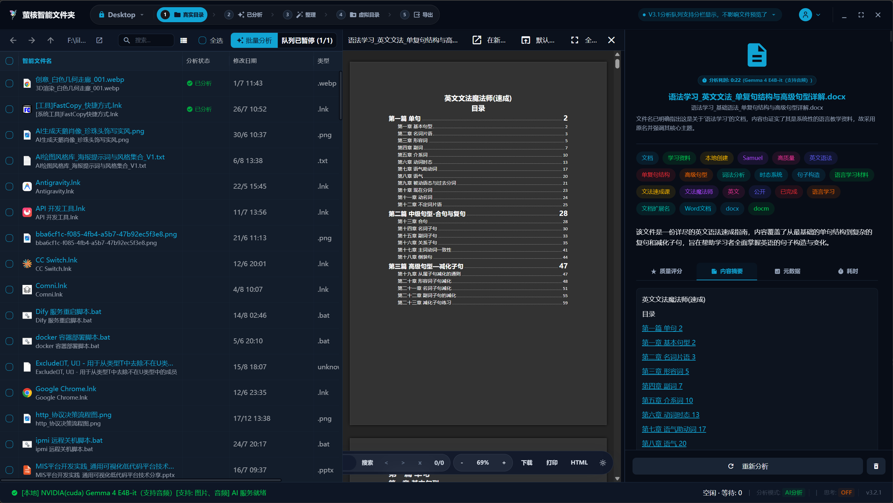
</p>

### ✏️ 基于语义的智能重命名

告别 "新建文本文档(1).txt" 或 "DSC_0042.jpg"，根据文件内容精准批量改名。

- 告别默认乱码名：彻底消除"新建文本文档"、"IMG_0001"
- 智能规则匹配：支持根据创建时间、AI 标签、主题批量重命名
- 灵活模板自定义：支持构建专属的自动化批量改名命名法则

<p align="center">
  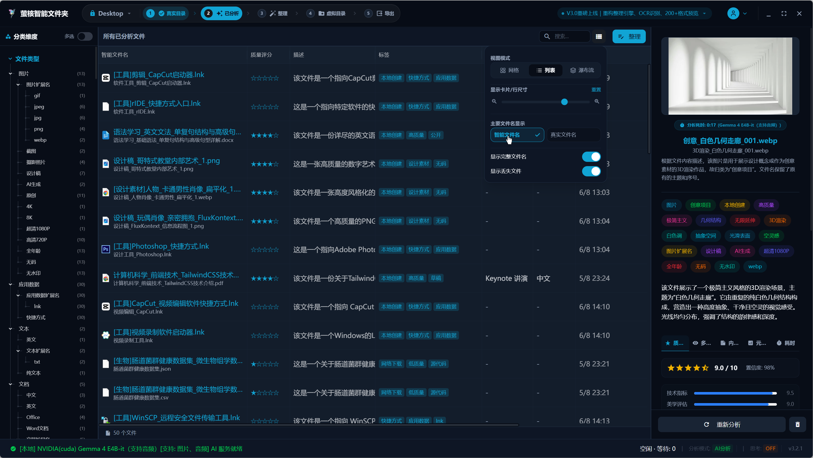
</p>

### 📂 独创 "多维虚拟目录"

不移动原始文件、不占额外硬盘空间，从工作项目/时间线/主题等多视角一键归类。

- 零硬盘占用：使用虚拟链接技术，避免产生重复副本
- 多视角归类：按照时间线、主题、维度树多重视图自由切换
- 安全无损：原始文件目录保持不动，彻底免除文件丢失风险

<p align="center">
  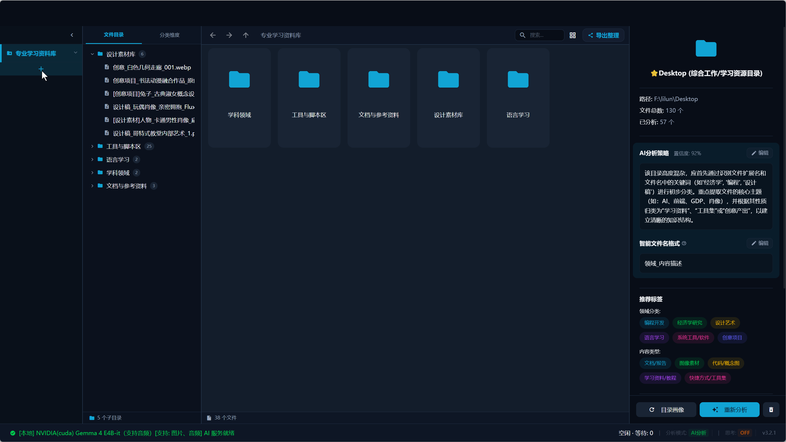
</p>

### 🔍 智能语义与全文检索

不仅搜文件名，更支持基于文件内容、AI 标签与语义摘要的深度搜索及查重去重。

- 深度全文检索：支持基于内容语义、摘要与 AI 标签的高精搜索
- 智能查重去重：精准识别重复文档与相似图片，完成高效文件清理
- 模糊意图匹配：即使记不清精确文件名，也能凭借印象瞬间找到

<p align="center">
  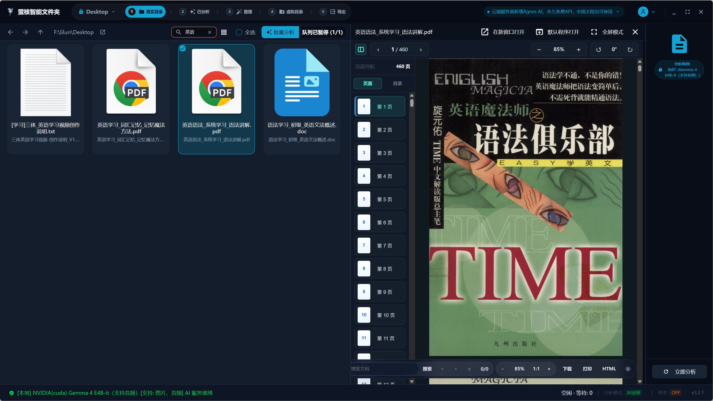
</p>

### 👁️ 200+ 格式原生预览与 OCR

内置强劲预览引擎，支持 Office/PDF/电子书/代码/3D 模型及图片 OCR 识别。

- 全格式支持：涵盖 Office、PDF、markdown、代码、3D 模型、音视频
- 本地高精 OCR：图片/扫描件文本秒级提取，自动转换为可检索文字
- 秒级响应：极速渲染预览图与缩略图，大幅提升文件查看效率

<p align="center">
  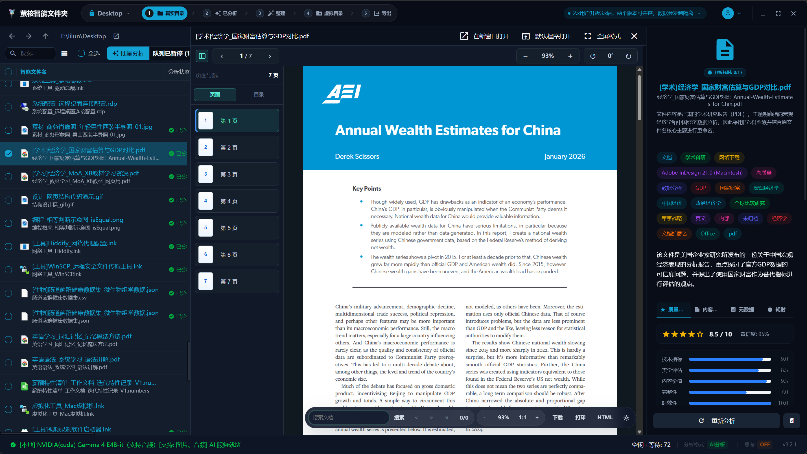
</p>

### ⭐ 文件质量评估与扩展名纠偏

自动评估文件价值与相关性排序，识别真实文件格式并纠正错误扩展名。

- AI 质量评分：根据文件价值自动排序，快速筛选高质资源
- 格式真实识别：依据文件头字节判断真实类型，解决打不开问题
- 扩展名一键纠偏：自动将 .tmp、.dat 等纠正为正确的后缀格式

<p align="center">
  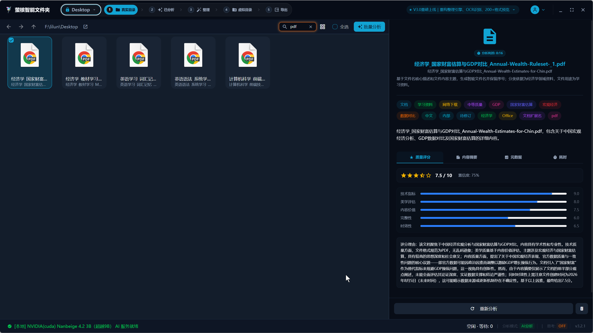
</p>

### 🛡️ 100% 隐私安全与数据自由

本地高性能 AI 引擎（支持 GPU/CPU 算力），数据存储于本地，零上传、免注册。

- 纯本地运行：无需连网、无需注册账号，离线环境全功能使用
- 零数据上传：敏感文档、私人照片数据永远保留在您的硬盘中
- 硬件智能加速：完美适配 NVIDIA GPU、Apple Silicon 与 CPU 算力

<p align="center">
  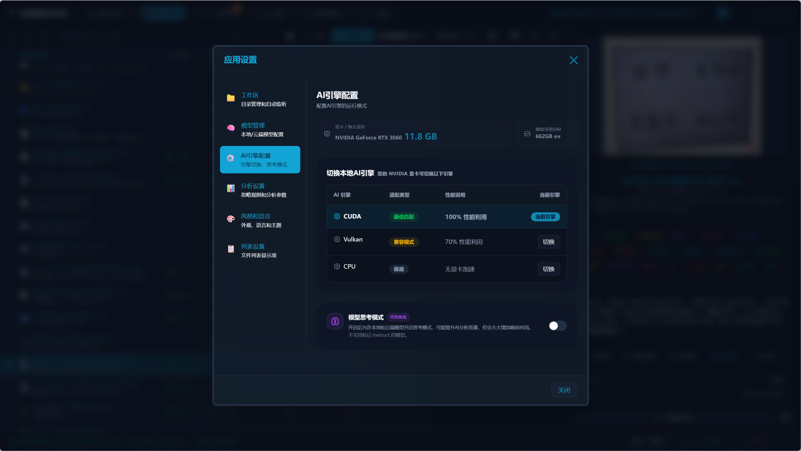
</p>

### 🌍 跨平台支持与多语言体验

基于 Electron 开发，完美支持 Windows / macOS / Linux，内置 10+ 种语言界面。

- 全平台覆盖：深度支持 Windows、macOS (Intel/Apple) 及 Linux
- 现代化 UI 设计：贴合系统设计语言，美观流畅
- 多语言原生集成：内置 10+ 种主流语言，支持全球化使用

<p align="center">
  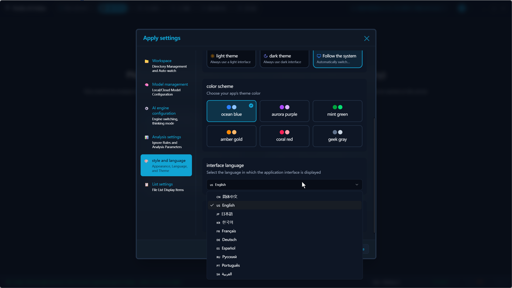
</p>

---

## 🖼️ 应用展示

### 🔍 真实目录实时嗅探

支持任意选择已有磁盘目录，自动监控文件变动并实时增量分析。

<p align="center">
  
</p>

### 🗂️ 灵活工作区模式

支持极速模式与私有模式，满足性能与隐私的不同偏好。

<p align="center">
  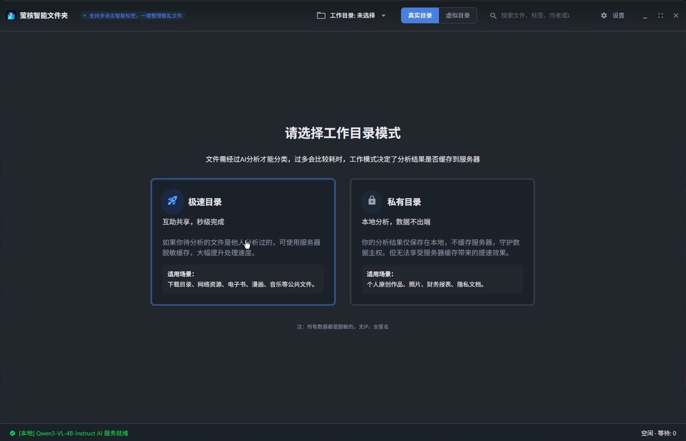
</p>

### 📂 多维虚拟目录树

根据 AI 维度自动组装多级目录树，零占用磁盘空间。

<p align="center">
  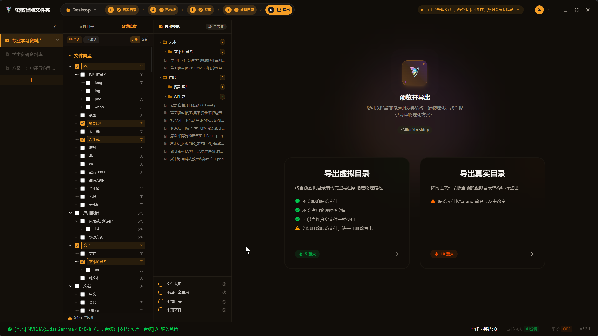
</p>

### 🤖 AI 双引擎架构

本地大模型与在线 API 双重模式，效率与隐私兼得。

<p align="center">
  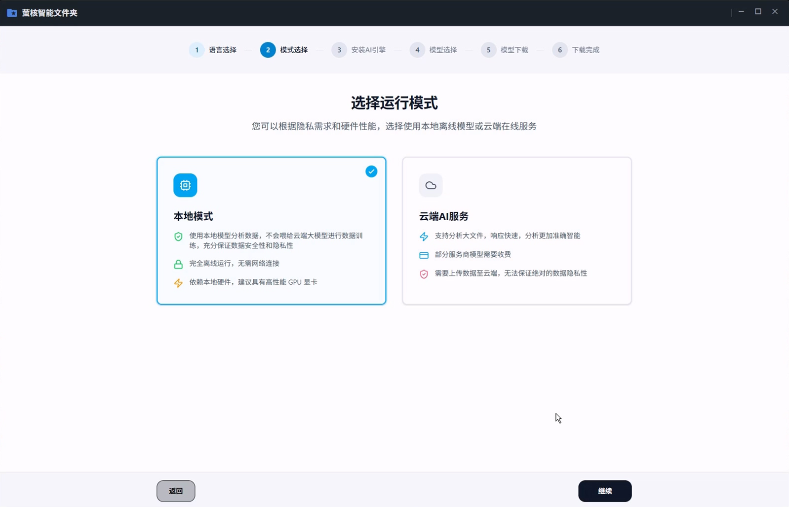
</p>

### 🚀 海量文件批量整理

支持数万级文件队列并行提取元数据，高效稳定。

<p align="center">
  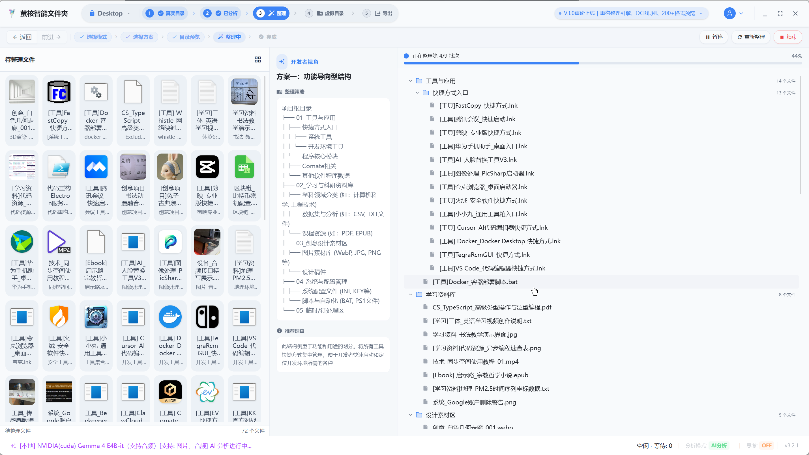
</p>

### 💡 硬件感知与模型推荐

自动侦测显存与 CPU 性能，精准推荐最佳规格的本地模型。

<p align="center">
  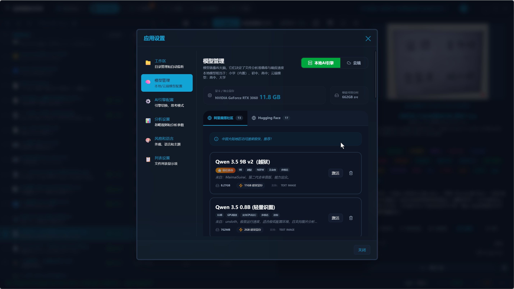
</p>

### 📝 整理方案自动生成

三份整理方案，多视角归档文件，高效稳定。

<p align="center">
  
</p>

### 📤 强大的导出支持

支持虚拟目录树导出和真实目录导出，满足不同场景需求。

<p align="center">
  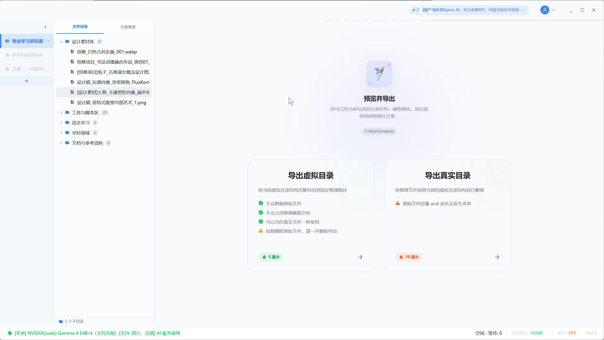
</p>

---

## 🚀 应用优势

### 🛠️ 技术优势

- **先进 AI 技术**：集成最新 AI 模型，支持多模态（文本/图像/音频）分析。
- **跨平台支持**：支持 Windows、macOS、Linux 三大操作系统。
- **高性能处理**：优化的索引算法与 GPU 硬件加速支持，同时支持CPU推理。
- **离线优先**：无需网络连接即可完成核心分析，极速响应。
- **云端缓存**：利用云端缓存加速 AI 分析过程，提高处理效率。

### 💎 功能优势

- **智能分类**：AI 驱动的自动文件分类和标签生成。
- **高效管理**：虚拟文件夹技术，不占用额外存储空间。
- **多维搜索**：支持按内容摘要、标签、质量等多维度搜索。
- **一键操作**：简化复杂操作，提升用户体验。

### 🌈 用户体验优势

- **直观界面**：现代化 UI 设计，符合桌面系统设计规范。
- **流畅操作**：优化的性能，流畅的用户交互。
- **多语言支持**：支持中文、英文、日文、韩文等 10 种语言。

---

## ❓ 常见问题

**Q: 电脑里充斥大量重复文件，硬盘空间不够怎么办？**

A: 使用萤核的「文件去重」与「文件清理」功能。系统会自动通过二进制与 AI 图像/文本语义对比，精准找出藏匿在各个文件夹中的重复与高度相似文件，支持一键安全释放空间。

**Q: 手机/相机导出的照片都是 DSC_001.jpg，找文件像大海捞针？**

A: 利用「智能批量改名」引擎。AI 会自动识别照片中的场景（如"2026海边度假"）或文档核心标题，一键批量重命名，彻底告别默认无意义文件名。

**Q: 下载的文件打不开，提示扩展名错误？**

A: 萤核内置「文件格式真实识别与扩展名纠偏」，不依赖文件名后缀，直接校验文件头字节，秒级帮你修复损坏或错误的扩展名。

**Q: 担心企业文档或私人文件被上传到云端大模型导致泄露？**

A: 萤核采用「100% 本地 AI 引擎」，所有文件分析、OCR 识别与语义索引都在您的电脑本地 GPU/CPU 上完成，绝不连网上传任何字节，隐私绝对安全。

---

## 🛠️ 技术架构

- **核心框架**: [Electron](https://www.electronjs.org/) + [Electron Vite](https://electron-vite.org/)
- **前端技术**: React 19 + TypeScript + Tailwind CSS + Zustand
- **AI 引擎**: [llama.cpp](https://github.com/ggml-org/llama.cpp) + LlamaIndex (本地推理)
- **数据库**: [Better-SQLite3](https://github.com/WiseLibs/better-sqlite3)
- **原生依赖**: ffmpeg, sharp, textract, libreoffice-convert
- **国际化**: VoerkaI18n (源码即文案模式)

---

## 📦 构建说明

如果您需要自行构建：

### 前置要求

- **Node.js**: v22+
- **pnpm**: 推荐使用
- **llama.cpp**: 本地 AI 推理环境

### 构建步骤

```bash
# 安装依赖
pnpm install

# 启动开发服务器
pnpm dev

# 打包应用程序
pnpm build
pnpm package
```

---

## 🌐 生态与社区

- **萤核桌面客户端**: https://github.com/Leonard-Li777/firefly-ai-folder-desktop
- **文件整理 Core Skill**: https://github.com/Leonard-Li777/ai-folder-organize
- **前沿 AI 模型**: [Qwen3.6](https://qwen.ai/) · [Nanbeige4.2](https://arxiv.org/abs/2602.13367) · [Gemma4](https://ai.google.dev/gemma/docs/core)
- **模型双源加速下载**: [阿里魔搭](https://modelscope.cn) · [HuggingFace](https://huggingface.co)
- **生态 Skill 社区**: [ClawHub](https://clawhub.ai/leonard-li777/skills/ai-folder-organize) · [魔搭Skill](https://modelscope.cn/skills/seaeye/ai-folder-organize/summary)
- **官方交流社区**: [萤核知乎圈子](https://www.zhihu.com/ring/2019089912897478826)

---

## 📬 联系我们

- **官方网站**: [https://aifolder.iocn.cn](https://aifolder.iocn.cn)

<p>
  

  
</p>
