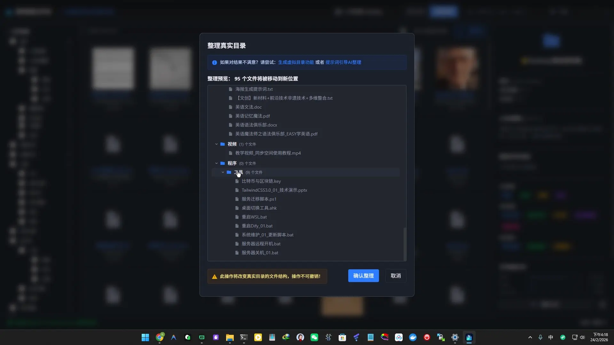
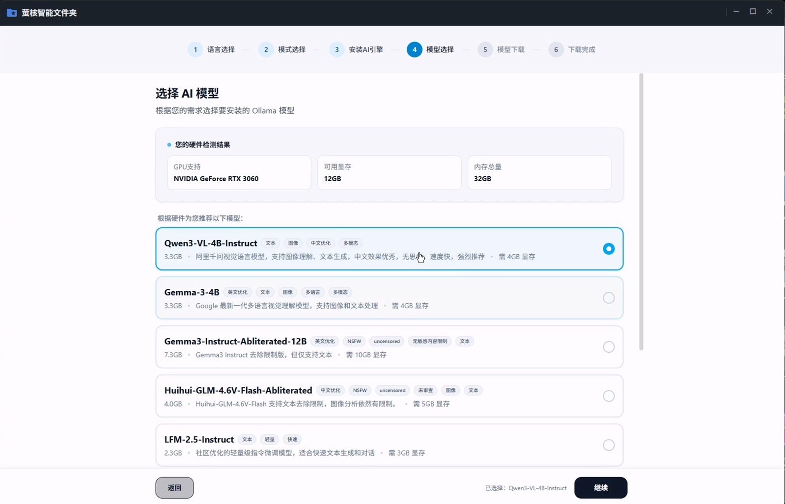
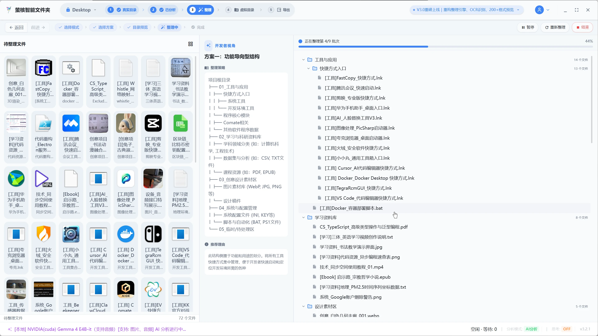
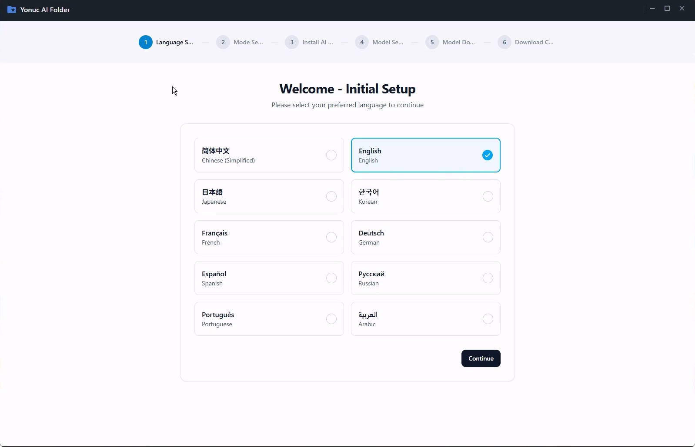

# <p align="center">Yonuc AI Folder - 萤核智能文件夹</p>

### <p align="center"><b>中文</b> | <a href="README_EN.md">English</a></p>

<p align="center">
  
</p>

<p align="center">
  <strong>AI 驱动的智能文件管理工具 —— 重新定义您的本地文件组织方式</strong>
</p>

<p align="center">
  <a href="../../LICENSE">
    
  </a>
  
  
</p>

---

## 🌟 项目简介

**萤核 (Yonuc) 智能文件夹** 是一款利用先进 AI 技术实现的智能文件管理工具。它深度集成本地大模型，提供智能文件分析、虚拟文件夹管理、一键自动整理等核心功能。

与传统文件管理器不同，萤核将 AI 的理解能力引入文件系统，让您的文件不再只是冷冰冰的数据，而是具备语义、质量评分和多维标签的知识资产。

<p align="center">
  
</p>

---

## 📺 演示视频

点击下方预览图查看 B 站演示视频，了解萤核如何改变您的文件管理体验：

<p align="center">
  <a href="https://www.bilibili.com/video/BV1gZAUzUEXe" target="_blank">
    
  </a>
</p>

---

## ✨ 核心功能

### 🧠 AI 智能分析
利用先进的 AI 技术分析和理解您的数据，支持文本、图片、音视频等多种媒体类型的智能分析。

### 📁 虚拟文件夹
使用文件链接技术整理文件生成虚拟文件夹，不占存储空间，实现高效的空间利用。

### ⚡ 一键整理
快速精准分类文件和命名，简化文件管理。AI 驱动的智能分类算法，极大提升效率。

### ⚙️ 自定义整理
丰富的目录树标签助你自定义组织文件，支持灵活的标签系统和维度管理。

### 🛡️ 隐私安全
本地大模型处理，数据不上云。离线 AI 处理，确保数据完全保留在本地。

### ⭐ 质量评分
通过智能分析为文件质量打分，AI 驱动的质量评估算法，帮助快速识别高质量内容。

---

## 🖼️ 应用展示

### 🔍 真实目录管理
任意选择需要整理的文件，支持文件增删嗅探自动分析。
<p align="center">
  
</p>

### 🗂️ 目录管理模式
支持极速模式和私有模式，满足您的不同需求。
<p align="center">
  
</p>

### 📂 虚拟目录管理
浏览 AI 分析结果，个性化的定制你的目录结构，不占文件空间。
<p align="center">
  
</p>

### 🤖 AI 引擎双模式支持
同时支持本地模式和云端模式，隐私和效率兼顾。
<p align="center">
  
</p>

### 📝 整理预览
一键整理，支持预览，省心更放心。
<p align="center">
  
</p>

### 💡 本地模型推荐
根据您的机器性能，推荐本地 AI 模型列表。
<p align="center">
  
</p>

### 🚀 批量处理
批量处理整理，文件再多也不怕。
<p align="center">
  
</p>

### 🌐 国际化支持
完善的国际化支持，内置 10 种语言。
<p align="center">
  
</p>

---

## 🚀 应用优势

### 🛠️ 技术优势
- **先进 AI 技术**：集成最新 AI 模型，支持多模态（文本/图像/音频）分析。
- **跨平台支持**：支持 Windows、macOS、Linux 三大操作系统。
- **高性能处理**：优化的索引算法与 GPU 硬件加速支持，同时支持CPU推理。
- **离线优先**：无需网络连接即可完成核心分析，极速响应。
- **云端缓存**：利用云端缓存加速 AI 分析过程，提高处理效率。

### 💎 功能优势
- **智能分类**：AI 驱动的自动文件分类和标签生成。
- **高效管理**：虚拟文件夹技术，不占用额外存储空间。
- **多维搜索**：支持按内容摘要、标签、质量等多维度搜索。
- **一键操作**：简化复杂操作，提升用户体验。

### 🌈 用户体验优势
- **直观界面**：现代化 UI 设计，符合桌面系统设计规范。
- **流畅操作**：优化的性能，流畅的用户交互。
- **多语言支持**：支持中文、英文、日文、韩文等 10 种语言。

---

## 🛠️ 技术架构

- **核心框架**: [Electron](https://www.electronjs.org/) + [Electron Vite](https://electron-vite.org/)
- **前端技术**: React 19 + TypeScript + Tailwind CSS + Zustand
- **AI 引擎**: [llama.cpp](https://github.com/ggml-org/llama.cpp) + LlamaIndex (本地推理)
- **数据库**: [Better-SQLite3](https://github.com/WiseLibs/better-sqlite3)
- **原生依赖**: ffmpeg, sharp, textract, libreoffice-convert
- **国际化**: VoerkaI18n (源码即文案模式)

---

## 📦 构建说明

如果您需要自行构建：

### 前置要求
- **Node.js**: v22+
- **pnpm**: 推荐使用
- **llama.cpp**: 本地 AI 推理环境

### 构建步骤
```bash
# 安装依赖
pnpm install

# 启动开发服务器
pnpm dev

# 打包应用程序
pnpm build
pnpm package
```
---


## 📬 联系我们

- **官方网站**: [https://aifolder.iocn.cn](https://aifolder.iocn.cn)

<p>
  

  
</p>
